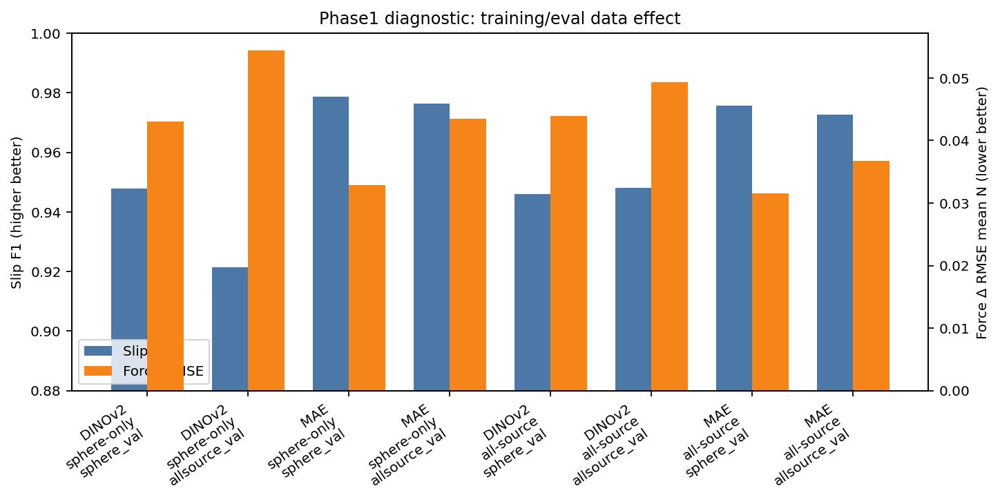
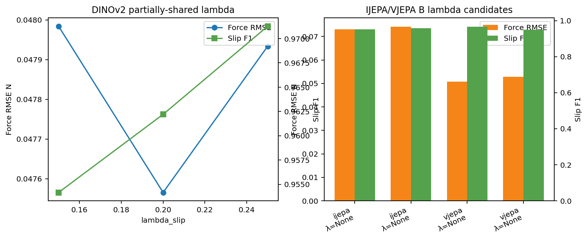
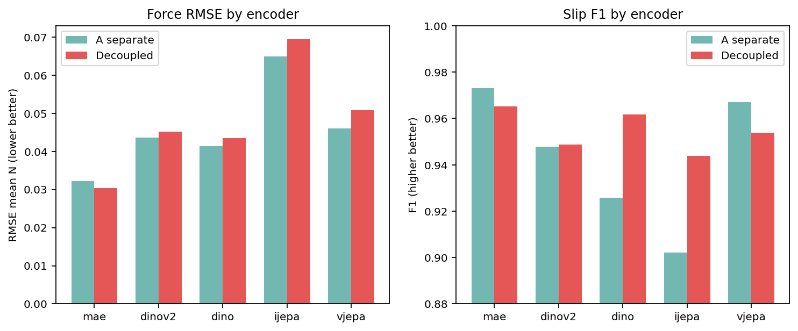
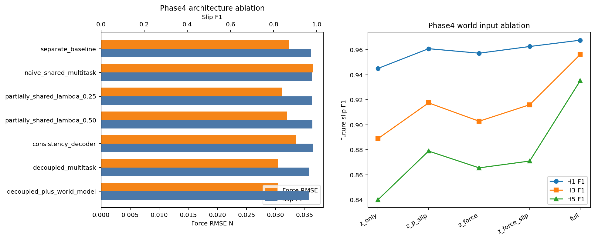
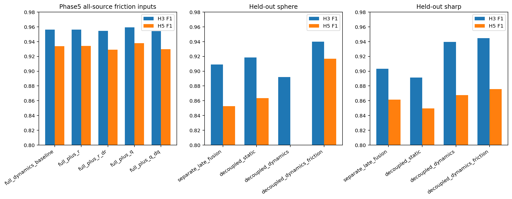
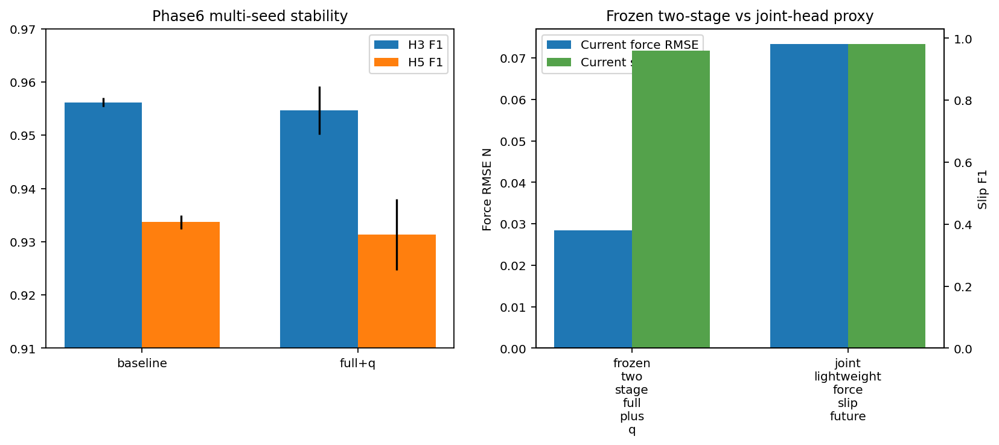

# Training Results Consolidated Report

- generated_at: `2026-05-18T02:23:49`
- server_repo: `/home/zjy/document/tactile-grasp`
- branch: `sparsh-force-slip`
- latest_commit_before_report: `8307ce3 Record Phase6 runtime provenance for auditability`
- local_sync_target: `/home/zjy/Documents/grasp/tactile_grasp/sparsh-force-slip/reports/training_results.md`
- scope: Phase1 到 Phase6 已生成的 force/slip、multitask、future-stability、friction-aware、held-out 和 early-warning 结果。

> 说明：本文件是已有 JSON/MD report 的聚合总结，不重新训练模型，不修改 `/vla1/zjy/tactile_datasets` 原始数据。数值以已保存 report 为准；完整细节、checkpoint、W&B 和日志路径见文末 source reports。

## 0. 目前最重要的结论

1. **当前 force/slip 单任务或强 baseline 仍然很强**：SPARSH-style separate probing 在 current slip F1 上通常很高；简单把 force 和 slip 合成一个共享 decoder 容易带来 force negative transfer。
2. **当前任务最稳定的联合路线是 MAE + decoupled multitask**：Phase3/Phase4 中 MAE decoupled 在 force RMSE 上最好或接近最好，同时 slip F1 可接受。
3. **论文主贡献更适合放在 future-stability / tactile dynamics，而不是声称联合预测全面超过单任务**：Phase4/5/6 的多步 future slip/stability、friction-aware conditioning、held-out contact stress test 是更有说服力的创新线。
4. **friction-aware full+q 不是所有 F1 都稳定提升，但能提供可解释性和稳健性证据**：Phase6 多 seed 中 full+q 的 AUPRC / high-risk 方向更稳，但 H3/H5 F1 不应过度声称全面优于 baseline。
5. **frozen two-stage 设计有必要**：Phase6-3 joint lightweight 虽提高 slip/future 部分指标，但 current force RMSE 从 0.0284 变差到 0.0734，支持冻结感知 + future head 的 two-stage 设计。

## 1. 新生成的总览对比图

这些图是本次整理时基于已有 report 重新生成的综合图，位于 `reports/training_results_assets/`。
- 
- 
- 
- 
- 
- 

## 2. Phase1：数据派生与 all-source slip diagnostic

- 原始数据：`/vla1/zjy/tactile_datasets` 未修改。
- 派生数据：`/vla1/zjy/sparsh_runs/force_slip_phase1/phase1_gsmini_20260512_043331/derived_gsmini`。
- Phase1 主要解决 flat/sharp/sphere 合并、slip 对齐、force 轴语义与 Newton 单位确认，以及 all-source diagnostic。

| encoder | train data | eval set | n | pos ratio | acc | slip F1 | slip recall | force ΔRMSE N |
| --- | --- | --- | --- | --- | --- | --- | --- | --- |
| DINOv2 | sphere-only | sphere_val | 9855 | 0.1999 | 0.9786 | 0.9479 | 0.9736 | 0.0430 |
| DINOv2 | sphere-only | allsource_val | 14920 | 0.2468 | 0.9589 | 0.9213 | 0.9747 | 0.0544 |
| MAE | sphere-only | sphere_val | 9855 | 0.1999 | 0.9916 | 0.9788 | 0.9726 | 0.0328 |
| MAE | sphere-only | allsource_val | 14920 | 0.2468 | 0.9884 | 0.9763 | 0.9680 | 0.0434 |
| DINOv2 | all-source | sphere_val | 9855 | 0.1999 | 0.9777 | 0.9461 | 0.9797 | 0.0440 |
| DINOv2 | all-source | allsource_val | 14920 | 0.2468 | 0.9735 | 0.9480 | 0.9777 | 0.0493 |
| MAE | all-source | sphere_val | 9855 | 0.1999 | 0.9902 | 0.9756 | 0.9838 | 0.0316 |
| MAE | all-source | allsource_val | 14920 | 0.2468 | 0.9864 | 0.9727 | 0.9826 | 0.0367 |

**解读**：MAE 在 sphere-only 与 all-source 上整体 slip F1 更高；DINOv2 all-source 相比 sphere-only 在 allsource_val 上提升明显，但在 sphere_val 上略有 tradeoff。因此后续选择 all-source 作为 broad coverage 诊断，而不是直接否定 sphere-only baseline。

## 3. Phase2：A/B/C multitask、lambda、consistency 参数效果

### 3.1 DINOv2 partially-shared lambda probe

| lambda | epoch | gate | force RMSE | force Δ vs A | slip F1 | slip drop pp vs A | note |
| --- | --- | --- | --- | --- | --- | --- | --- |
| 0.25 | 51 | warning_band | 0.0479 | 9.91% | 0.9713 | -2.35 | previous warning-band slip-F1 best |
| 0.20 | 50 | warning_band | 0.0476 | 9.06% | 0.9622 | -1.45 | new force-safer warning-band baseline used for C |
| 0.15 | 51 | hard_fail | 0.0480 | 10.02% | 0.9542 | -0.64 | new lower-lambda probe |

**解读**：DINOv2 B 的 lambda 不是越小越好；λ=0.20 被选为 force-safer warning-band baseline，λ=0.25 slip F1 更高但 force 代价稍大，λ=0.15 hard-fail。

### 3.2 Consistency decoder / consistency loss

| encoder | lambda | beta | tau source | tau | force RMSE | slip F1 | gate vs A | gate vs B | contradiction ↓ vs B | MCE ↓ vs B | success |
| --- | --- | --- | --- | --- | --- | --- | --- | --- | --- | --- | --- |
| dinov2 | 0.2 | 0.05 | p65 | 0.0817 | 0.0480 | 0.9665 | warning_band | pass | 38.76% | 100.00% | True |
| mae | 0.5 | 0.05 | p65 | 0.0817 | 0.0335 | 0.9819 | pass | warning_band | 32.33% | -172.99% | True |

**解读**：Consistency 能降低 force-slip contradiction，但仍需同时看 force RMSE。MAE C 的 slip F1 高，但 force RMSE 相比 A 有一定增加；DINOv2 C 是 warning-band success。

### 3.3 IJEPA / VJEPA A-B-C

| encoder | A force RMSE | A slip F1 | best B λ | best B gate | best B force RMSE | best B slip F1 | C gate | paper recommendation |
| --- | --- | --- | --- | --- | --- | --- | --- | --- |
| ijepa | 0.0649 | 0.9022 | 0.50 | hard_fail | 0.0742 | 0.9574 | not_run_b_hard_fail | do_not_include_as_main_result; use as diagnostic/supplementary negative result only |
| vjepa | 0.0461 | 0.9671 | 0.25 | hard_fail | 0.0507 | 0.9667 | not_run_b_hard_fail | do_not_include_as_main_result; use as diagnostic/supplementary negative result only |

**解读**：IJEPA/VJEPA 在当时的 partially-shared B sweep 中均因 force RMSE hard-fail，不适合作为主结果，只适合作为补充或负结果。

## 4. Phase3：五个 backbone 的 decoupled current-task 对比

| encoder | A force RMSE | decoupled force RMSE | Δ force | A slip F1 | decoupled slip F1 | F1 drop pp | gate |
| --- | --- | --- | --- | --- | --- | --- | --- |
| mae | 0.0322 | 0.0304 | -5.75% | 0.9731 | 0.9652 | 0.79 | pass |
| dinov2 | 0.0436 | 0.0451 | 3.51% | 0.9477 | 0.9488 | -0.11 | pass |
| dino | 0.0414 | 0.0435 | 4.94% | 0.9257 | 0.9616 | -3.60 | pass |
| ijepa | 0.0649 | 0.0695 | 7.00% | 0.9022 | 0.9438 | -4.16 | warning_band |
| vjepa | 0.0461 | 0.0508 | 10.20% | 0.9671 | 0.9539 | 1.32 | hard_fail |

- best_backbone: `mae`
- selection priority: force RMSE non-degradation > slip F1 retained/improved > consistency improvement > per-domain stability。

**解读**：MAE decoupled 的 force RMSE 从 A 的 0.0322 降到 0.0304，是当前任务里最稳的路线；DINO/DINOv2 slip 有提升或保持，但 force 代价更高；IJEPA/VJEPA 不适合升为主线。

## 5. Phase3-2：lightweight tactile world model / future-stability stages

| stage | best epoch | horizons | H1 F1 | H1 AUROC | H1 AUPRC | H1 stability ECE | latent MSE |
| --- | --- | --- | --- | --- | --- | --- | --- |
| proxy | 35 | [1] | 0.9594 | 0.9985 | 0.9957 | 0.0326 | NA |
| latent | 35 | [1] | 0.9625 | 0.9981 | 0.9951 | 0.0085 | 0.002233 |
| multihorizon | 32 | [1, 3, 5] | 0.9645 | 0.9977 | 0.9947 | 0.0053 | NA |

Frozen decoupled current-task metrics retained during Phase3-2：force RMSE `0.0284`，slip F1 `0.9593`，slip accuracy `0.9819`。

**解读**：从 proxy 到 latent / multihorizon，future slip F1 保持在较高水平；multihorizon 提供 H1/H3/H5 的论文叙事基础，但应表述为 future slip-free probability / instability risk，而不是直接 grasp success。

## 6. Phase4：论文实验主线整理

### 6.1 MAE route 多 seed 稳定性

| metric | mean | std | n |
| --- | --- | --- | --- |
| separate_force_rmse_mean_N | 0.0315 | 0.0009 | 3 |
| separate_slip_f1 | 0.9716 | 0.0033 | 3 |
| decoupled_force_rmse_mean_N | 0.0317 | 0.0012 | 3 |
| decoupled_slip_f1 | 0.9729 | 0.0067 | 3 |
| world_H1_future_slip_f1 | 0.9655 | 0.0013 | 3 |
| world_H1_future_slip_auprc | 0.9954 | 0.0007 | 3 |
| world_H1_stability_ece | 0.0051 | 0.0012 | 3 |
| world_H3_future_slip_f1 | 0.9548 | 0.0041 | 3 |
| world_H5_future_slip_f1 | 0.9311 | 0.0078 | 3 |

### 6.2 Separate late fusion vs decoupled joint vs dynamics

| condition | H1 F1 | H3 F1 | H5 F1 | H1 AUPRC | H3 AUPRC | H5 AUPRC |
| --- | --- | --- | --- | --- | --- | --- |
| separate_late_fusion | 0.9644 | 0.9203 | 0.8800 | 0.9849 | 0.9625 | 0.9390 |
| decoupled_joint | 0.9626 | 0.9160 | 0.8710 | 0.9842 | 0.9635 | 0.9401 |
| decoupled_joint_dynamics | 0.9676 | 0.9562 | 0.9353 | 0.9953 | 0.9936 | 0.9800 |

### 6.3 World-model input ablation

| input condition | H1 F1 | H3 F1 | H5 F1 | H1 AUPRC | H5 AUPRC |
| --- | --- | --- | --- | --- | --- |
| z_only | 0.9450 | 0.8890 | 0.8401 | 0.9655 | 0.8971 |
| z_p_slip | 0.9608 | 0.9175 | 0.8790 | 0.9833 | 0.9374 |
| z_force | 0.9572 | 0.9028 | 0.8656 | 0.9778 | 0.9252 |
| z_force_slip | 0.9626 | 0.9160 | 0.8710 | 0.9842 | 0.9401 |
| full | 0.9676 | 0.9562 | 0.9353 | 0.9953 | 0.9800 |

### 6.4 Current-task architecture ablation

| condition | architecture | force RMSE | slip F1 | slip acc | force Δ vs separate | slip Δ pp vs separate |
| --- | --- | --- | --- | --- | --- | --- |
| separate_baseline | SPARSH-style separate force-only + slip-only | 0.0322 | 0.9731 | 0.9866 | 0.00% | 0.00 |
| naive_shared_multitask | one shared decoder trunk for force and slip | 0.0364 | 0.9784 | 0.9893 | 12.88% | 0.53 |
| partially_shared_lambda_0.25 | shared pooler with task-private trunks | 0.0311 | 0.9771 | 0.9887 | -3.61% | 0.40 |
| partially_shared_lambda_0.50 | shared pooler with task-private trunks | 0.0319 | 0.9799 | 0.9901 | -0.98% | 0.68 |
| consistency_decoder | partially shared + force/slip consistency regularizer | 0.0335 | 0.9819 | 0.9911 | 3.99% | 0.88 |
| decoupled_multitask | task-private force/slip poolers and heads | 0.0304 | 0.9652 | 0.9825 | -5.75% | -0.79 |
| decoupled_plus_world_model | decoupled current-task model + lightweight multi-horizon future-stability head | 0.0304 | 0.9652 | 0.9825 | -5.75% | -0.79 |

**解读**：Phase4 明确了论文主线：SPARSH separate 是强 current-task baseline；naive shared multitask 会明显伤 force；decoupled 适合保留 current-task；加入 dynamics 输入后 H3/H5 future slip 明显更好。

## 7. Phase5：friction-aware stability proxy

### 7.1 Ft/Fn 与 slip probability 的诊断

| force source | valid contacts | valid ratio | ratio mean | train p80 τ | high-ratio slip rate | Spearman(p_slip,ratio) | contradiction |
| --- | --- | --- | --- | --- | --- | --- | --- |

对应图：
- [phase5/phase5_1_friction_diagnostic/figures/phase5_1_ratio_hist_gt.png](phase5/phase5_1_friction_diagnostic/figures/phase5_1_ratio_hist_gt.png)
- [phase5/phase5_1_friction_diagnostic/figures/phase5_1_p_slip_vs_ratio_gt.png](phase5/phase5_1_friction_diagnostic/figures/phase5_1_p_slip_vs_ratio_gt.png)
- [phase5/phase5_1_friction_diagnostic/figures/phase5_1_ratio_hist_pred.png](phase5/phase5_1_friction_diagnostic/figures/phase5_1_ratio_hist_pred.png)
- [phase5/phase5_1_friction_diagnostic/figures/phase5_1_p_slip_vs_ratio_pred.png](phase5/phase5_1_friction_diagnostic/figures/phase5_1_p_slip_vs_ratio_pred.png)

### 7.2 Friction-aware future head 参数/输入对比

| condition | current force RMSE | current slip F1 | H1 F1 | H3 F1 | H5 F1 | H3 AUPRC | H5 AUPRC | best epoch |
| --- | --- | --- | --- | --- | --- | --- | --- | --- |
| full_dynamics_baseline | 0.0284 | 0.9593 | 0.9666 | 0.9564 | 0.9338 | 0.9936 | 0.9805 | 39 |
| full_plus_r | 0.0284 | 0.9593 | 0.9640 | 0.9562 | 0.9343 | 0.9935 | 0.9804 | 40 |
| full_plus_r_dr | 0.0284 | 0.9593 | 0.9652 | 0.9545 | 0.9292 | 0.9937 | 0.9807 | 40 |
| full_plus_q | 0.0284 | 0.9593 | 0.9668 | 0.9593 | 0.9381 | 0.9945 | 0.9815 | 40 |
| full_plus_q_dq | 0.0284 | 0.9593 | 0.9639 | 0.9543 | 0.9298 | 0.9943 | 0.9813 | 40 |

### 7.3 Held-out sphere contact geometry stress test

- split: train `['flat', 'sharp']`, test `['sphere']`

| condition | current force RMSE | current slip F1 | H1 F1 | H3 F1 | H5 F1 | H3 AUPRC | H5 AUPRC | best epoch |
| --- | --- | --- | --- | --- | --- | --- | --- | --- |
| separate_late_fusion | 0.0232 | 0.9739 | 0.9623 | 0.9089 | 0.8525 | 0.9436 | 0.9145 | 39 |
| decoupled_static | 0.0229 | 0.9672 | 0.9617 | 0.9185 | 0.8636 | 0.9456 | 0.9164 | 36 |
| decoupled_dynamics | 0.0229 | 0.9672 | 0.9552 | 0.8922 | 0.7392 | 0.9778 | 0.9543 | 40 |
| decoupled_dynamics_friction | 0.0229 | 0.9672 | 0.9620 | 0.9400 | 0.9169 | 0.9814 | 0.9573 | 40 |

**解读**：friction-aware 变量 q / ratio 提供了力学可解释性；held-out sphere 中 `decoupled_dynamics_friction` 对 H3/H5 表现最好或最稳。需要避免把 q/tau 写成真实测量摩擦系数，只能写成基于 predicted force 的经验稳定性 conditioning。

## 8. Phase6：稳定性、第二 held-out split、frozen vs joint、early warning

### 8.1 Multi-seed full dynamics vs full+q

| condition | H3 F1 mean | H3 F1 std | H3 AUPRC mean | H5 F1 mean | H5 F1 std | H5 AUPRC mean |
| --- | --- | --- | --- | --- | --- | --- |
| full_dynamics_baseline | 0.9562 | 0.0008 | 0.9937 | 0.9337 | 0.0013 | 0.9810 |
| full_plus_q | 0.9546 | 0.0045 | 0.9942 | 0.9313 | 0.0067 | 0.9813 |

**解读**：full+q 的 H3/H5 AUPRC 略高，但 F1 mean 不总是高于 baseline，且 full+q F1 std 更大。因此论文中适合声称“friction-aware conditioning 被多 seed 验证并提升风险排序/解释性”，不适合说“所有指标全面提升”。

### 8.2 Held-out sharp contact geometry stress test

- split: train `['flat', 'sphere']`, test `['sharp']`

| condition | current force RMSE | current slip F1 | H1 F1 | H3 F1 | H5 F1 | H3 AUPRC | H5 AUPRC | best epoch |
| --- | --- | --- | --- | --- | --- | --- | --- | --- |
| separate_late_fusion | 0.0429 | 0.9701 | 0.9556 | 0.9031 | 0.8614 | 0.9435 | 0.9174 | 37 |
| decoupled_static | 0.0372 | 0.9606 | 0.9597 | 0.8914 | 0.8494 | 0.9475 | 0.9211 | 37 |
| decoupled_dynamics | 0.0372 | 0.9606 | 0.9659 | 0.9397 | 0.8675 | 0.9866 | 0.9661 | 40 |
| decoupled_dynamics_friction | 0.0372 | 0.9606 | 0.9644 | 0.9447 | 0.8756 | 0.9870 | 0.9665 | 38 |

**解读**：train flat+sphere、test sharp 的更难泛化中，`decoupled_dynamics_friction` H3/H5 F1 和 AUPRC 仍然最好或接近最好，支持 contact-geometry holdout 的补强结论。

### 8.3 Frozen two-stage vs joint lightweight ablation

| condition | current force RMSE | current slip F1 | H1 F1 | H3 F1 | H5 F1 | H3 AUPRC | H5 AUPRC |
| --- | --- | --- | --- | --- | --- | --- | --- |
| frozen_two_stage_full_plus_q | 0.0284 | 0.9593 | 0.9668 | 0.9593 | 0.9381 | 0.9945 | 0.9815 |
| joint_lightweight_force_slip_future | 0.0734 | 0.9816 | 0.9838 | 0.9649 | 0.9374 | 0.9956 | 0.9816 |

**解读**：joint lightweight 提高 slip F1 / H1-H3 future 部分指标，但 current force RMSE 大幅恶化；这是采用 frozen perception + future dynamics head 的关键证据。

### 8.4 Early-warning analysis

| metric | value |
| --- | --- |
| trajectory_count | 228.0000 |
| slip_trajectories | 215.0000 |
| detected_pre_slip_trajectories | 108.0000 |
| late_warning_trajectories | 107.0000 |
| missed_slip_trajectories | 0.0000 |
| false_alarm_trajectories | 0.0000 |
| early_warning_recall | 0.5023 |
| lead_time_to_slip_onset_steps_mean | 5.6019 |
| lead_time_to_slip_onset_steps_median | 1.0000 |

| case | dataset | trajectory | onset | first warning | lead | max prob | figure |
| --- | --- | --- | --- | --- | --- | --- | --- |
| success_early_warning | sharp_batch_1_val | 9 | 74 | 1 | 73 | 1.0000 | phase6/phase6_4_early_warning_analysis/figures/main_success_early_warning_sharp_batch_1_val_9.png |
| late_warning | flat_batch_1_val | 17 | 39 | 39 | 0 | 1.0000 | phase6/phase6_4_early_warning_analysis/figures/main_late_warning_flat_batch_1_val_17.png |
| missed_warning_absence_check | flat_batch_2_val | 15 | 14 | 17 | 0 | 0.9996 | phase6/phase6_4_early_warning_analysis/figures/main_missed_warning_absence_check_flat_batch_2_val_15.png |
| false_alarm_absence_check | sphere_batch_3_val | 7 | None | None | None | 0.4710 | phase6/phase6_4_early_warning_analysis/figures/main_false_alarm_absence_check_sphere_batch_3_val_7.png |
| heldout_contact_case | sharp_batch_1_val | 0 | 58 | 58 | 0 | 1.0000 | phase6/phase6_4_early_warning_analysis/figures/heldout_heldout_contact_case_sharp_batch_1_val_0.png |

**解读**：early-warning recall 约 0.5023，mean lead time 约 5.60 step，median lead time 1 step。报告中有 success early warning、late warning、missed warning absence check、false alarm absence check、held-out contact case 五类轨迹。

## 9. 已有可用图像与可放论文/补充材料的图

### 9.1 本次聚合生成的图
- `training_results_assets/phase1_data_training_effect.png`
- `training_results_assets/phase2_lambda_parameter_effects.png`
- `training_results_assets/phase3_encoder_current_task_comparison.png`
- `training_results_assets/phase4_architecture_input_ablation.png`
- `training_results_assets/phase5_phase6_friction_heldout_comparison.png`
- `training_results_assets/phase6_multiseed_frozen_joint.png`

### 9.2 历史阶段生成的图
- `phase1/phase1_gsmini_20260512_043331/flat_sharp_slip_alignment_examples/flat_batch_1_slip_alignment_event.png`
- `phase1/phase1_gsmini_20260512_043331/flat_sharp_slip_alignment_examples/flat_batch_2_slip_alignment_event.png`
- `phase1/phase1_gsmini_20260512_043331/flat_sharp_slip_alignment_examples/sharp_batch_1_slip_alignment_event.png`
- `phase1/phase1_gsmini_20260512_043331/flat_sharp_slip_alignment_examples/sharp_batch_2_slip_alignment_event.png`
- `phase1/phase1_gsmini_20260512_043331/preprocess_examples/flat_batch_1_dataset_gelsight.png`
- `phase1/phase1_gsmini_20260512_043331/preprocess_examples/flat_batch_2_dataset_gelsight.png`
- `phase1/phase1_gsmini_20260512_043331/preprocess_examples/sharp_batch_1_dataset_gelsight.png`
- `phase1/phase1_gsmini_20260512_043331/preprocess_examples/sharp_batch_2_dataset_gelsight.png`
- `phase1/phase1_gsmini_20260512_043331/preprocess_examples/sharp_batch_2_org_dataset_gelsight.png`
- `phase1/phase1_gsmini_20260512_043331/preprocess_examples/sphere_batch_1_dataset_gelsight.png`
- `phase5/phase5_1_friction_diagnostic/figures/phase5_1_p_slip_vs_ratio_gt.png`
- `phase5/phase5_1_friction_diagnostic/figures/phase5_1_p_slip_vs_ratio_pred.png`
- `phase5/phase5_1_friction_diagnostic/figures/phase5_1_ratio_hist_gt.png`
- `phase5/phase5_1_friction_diagnostic/figures/phase5_1_ratio_hist_pred.png`
- `phase5/phase5_4_visualization_failure_cases/figures/high_force_no_current_slip_sphere_batch_4_val_8.png`
- `phase5/phase5_4_visualization_failure_cases/figures/sharp_contact_case_sharp_batch_1_val_0.png`
- `phase5/phase5_4_visualization_failure_cases/figures/slip_with_low_friction_ratio_failure_sharp_batch_1_val_14.png`
- `phase5/phase5_4_visualization_failure_cases/figures/sphere_contact_case_sphere_batch_1_val_0.png`
- `phase5/phase5_4_visualization_failure_cases/figures/success_early_warning_flat_batch_1_val_2.png`
- `phase6/phase6_4_early_warning_analysis/figures/heldout_heldout_contact_case_sharp_batch_1_val_0.png`
- `phase6/phase6_4_early_warning_analysis/figures/main_false_alarm_absence_check_sphere_batch_3_val_7.png`
- `phase6/phase6_4_early_warning_analysis/figures/main_late_warning_flat_batch_1_val_17.png`
- `phase6/phase6_4_early_warning_analysis/figures/main_missed_warning_absence_check_flat_batch_2_val_15.png`
- `phase6/phase6_4_early_warning_analysis/figures/main_success_early_warning_sharp_batch_1_val_9.png`

## 10. 建议论文表格组织

### 主文表格建议

1. **Current force/slip baseline table**：SPARSH separate、naive shared、partially shared、consistency、decoupled。重点说明 naive shared 伤 force，decoupled 保留 force。
2. **Future stability method table**：separate late fusion、decoupled joint、decoupled+dynamics、full+q/friction-aware。重点放 H1/H3/H5 F1/AUPRC。
3. **Held-out contact stress test**：flat+sharp→sphere 和 flat+sphere→sharp 两个 split，展示 friction-aware dynamics 的泛化。
4. **Frozen vs joint ablation**：说明 two-stage 的必要性，避免审稿人质疑为什么不端到端联合。

### 补充材料建议

- Phase1 数据对齐与 all-source diagnostic。
- Phase2 lambda / beta / consistency 细节。
- IJEPA/VJEPA negative or diagnostic results。
- Multi-seed mean±std 和 early-warning/failure trajectory 可视化。

## 11. 安全表述与不能过度声称的点

可以安全声称：

- 基于 GSmini derived force/slip 数据，MAE decoupled + tactile dynamics future head 在 current-task 保留和 future-stability 上是目前最稳路线。
- friction-aware q / Ft/Fn conditioning 提供了可解释稳定性线索，并在两个 held-out contact geometry split 中进行了 stress test。
- frozen two-stage 设计比轻量 joint-head proxy 更能保护 force estimation。

不能过度声称：

- 不能说当前方法已经验证真实机械臂 grasp success。
- 不能把 q/tau 称为真实物理测量摩擦系数。
- 不能说 full+q 在所有 F1 指标上都稳定超过 baseline。
- 不能说 lightweight future head 等同完整 world model 或 end-to-end physical predictor。

## 12. Source report index

- Phase1 derived dataset artifacts: [`phase1/current_phase1_artifacts.md`](phase1/current_phase1_artifacts.md)
- Phase1 all-source diagnostic: [`phase1/phase1_gsmini_20260512_043331/diagnostic_allsource_slip_comparison_aggregate_eval.md`](phase1/phase1_gsmini_20260512_043331/diagnostic_allsource_slip_comparison_aggregate_eval.md)
- Phase2 DINOv2 lambda + consistency: [`phase2/phase2_b_c_lambda_consistency_summary_20260514.md`](phase2/phase2_b_c_lambda_consistency_summary_20260514.md)
- Phase2 IJEPA/VJEPA ABC: [`phase2/phase2_jepa_abc_summary_20260515.md`](phase2/phase2_jepa_abc_summary_20260515.md)
- Phase3 decoupled encoder comparison: [`phase3/phase3_1_20260516_154730/phase3_1_decoupled_multitask_report.md`](phase3/phase3_1_20260516_154730/phase3_1_decoupled_multitask_report.md)
- Phase3 lightweight world model: [`phase3/phase3_2_20260517_014013/phase3_world_model_summary.md`](phase3/phase3_2_20260517_014013/phase3_world_model_summary.md)
- Phase4 paper experiment summary: [`phase4/phase4_paper_experiment_summary_20260517/phase4_paper_experiment_summary.md`](phase4/phase4_paper_experiment_summary_20260517/phase4_paper_experiment_summary.md)
- Phase5 summary: [`phase5/phase5_summary.md`](phase5/phase5_summary.md)
- Phase6 summary: [`phase6/phase6_summary.md`](phase6/phase6_summary.md)

## 13. Reproducibility notes

- 所有训练和评估结果来自服务器 `/home/zjy/document/tactile-grasp` 的 `sparsh-force-slip` 分支。
- 已遵守“不自动 push/pull”的规则；本文档只整理已有结果。
- Phase5/Phase6 summary 中已记录 W&B name、tmux、GPU、checkpoint 等运行信息。
- 本文档和 assets 可通过 rsync 同步到本地 reports 目录。
